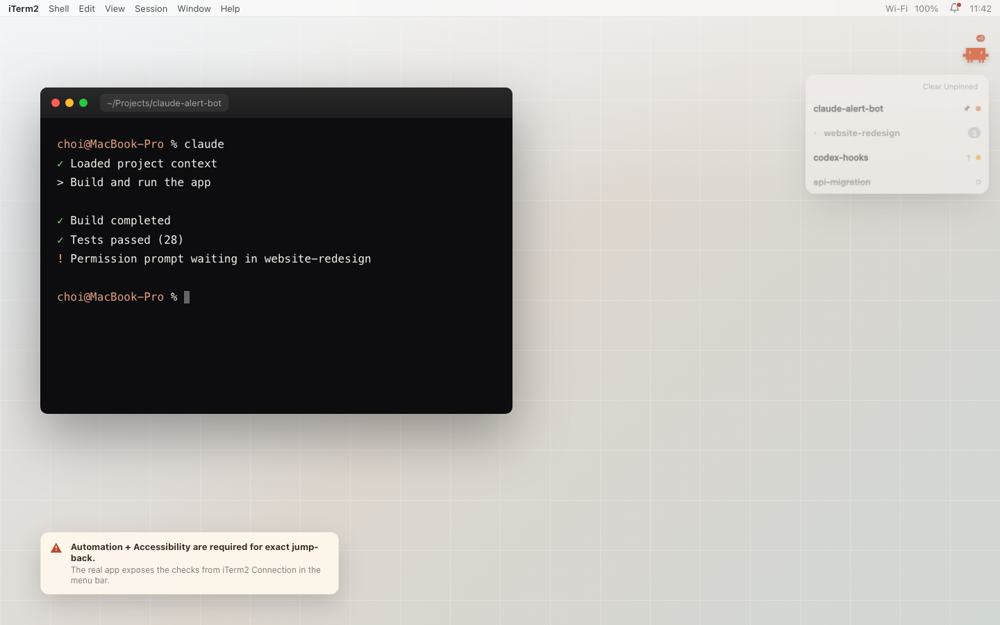
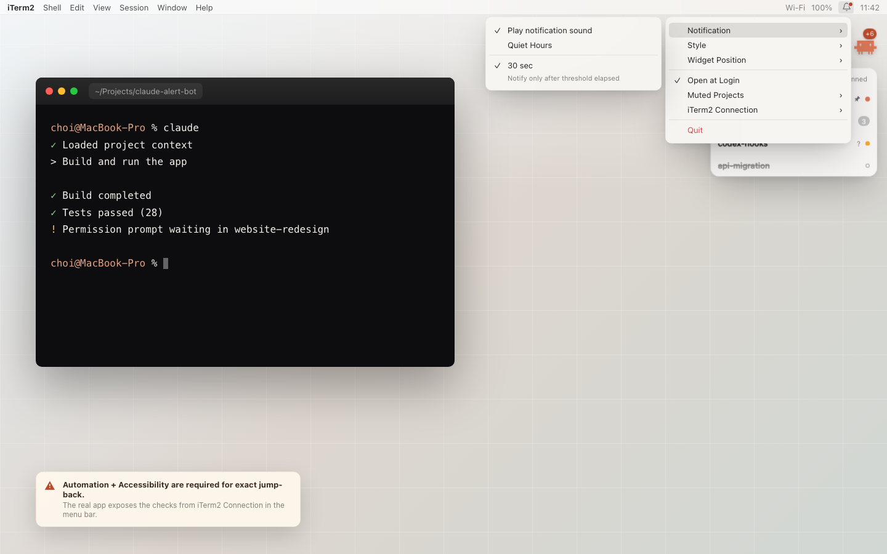

# Claude Alert Bot

[한국어](README.ko.md)

Claude Alert Bot is a native macOS utility for Claude Code and Codex users who work in iTerm2.
When a long-running session finishes, or when the agent pauses waiting for you, the app shows a floating widget on your desktop and lets you jump back to the exact iTerm2 tab or window that produced the event.

The main idea is simple: if the alert cannot take you back to the right terminal, it is not useful.
Claude Alert Bot is built around session-accurate jump-back rather than short-lived system banners.

## Screenshots





## What It Does

- Shows a floating Claude widget when a qualifying session completes or waits for input.
- Keeps a pending session queue until you clear it or jump back to the terminal.
- Jumps to the exact iTerm2 session for a row when you activate it.
- Filters noisy short runs with a configurable notification threshold.
- Supports waiting-input alerts from Claude notification hooks for permission prompts and elicitation dialogs.
- Lets you pin important rows, mute a project for 1 hour, or clear unpinned rows.
- Groups repeated alerts from the same project and shows a compact count badge.
- Offers menu bar controls for sound, Quiet Hours, widget position, animation, appearance, reduce motion, launch at login, muted projects, test notification, and iTerm2 connection testing.
- Installs and maintains the bundled hook reporter automatically on launch.

## Requirements

- macOS 14 Sonoma or later
- iTerm2
- Claude Code and/or Codex CLI
- Xcode 15.4 or later only if you want to build from source

## Install And First Run

1. Install a built `ClaudeAlertBot.app`, or build it locally from this repository.
2. Move the app to `/Applications` if you want a normal app-style install.
3. Launch the app.

If macOS blocks the unsigned app on first launch, use `System Settings > Privacy & Security > Open Anyway`.
As a fallback, clear quarantine manually:

```bash
xattr -cr /Applications/ClaudeAlertBot.app
```

Claude Alert Bot runs as an accessory app, so you control it from the bell icon in the macOS menu bar.

On launch, the app copies the bundled reporter script to:

```text
~/Library/Application Support/ClaudeAlertBot/cab-report.sh
```

It then merges hook registrations into:

- `~/.claude/settings.json`
- `~/.codex/hooks.json` and `~/.codex/config.toml` if `~/.codex` exists

The installed hook setup covers:

- `Stop` and `UserPromptSubmit` for Claude Code
- `Stop` and `UserPromptSubmit` for Codex when `~/.codex` exists
- `Notification` for Claude permission prompts / elicitation dialogs

After launch, open the bell menu and run `iTerm2 Connection > Test iTerm2 connection`.
macOS may ask for:

- Automation permission, so the app can control iTerm2
- Accessibility permission, so the app can reliably raise the exact iTerm2 window across Spaces

## Daily Use

1. Keep Claude Alert Bot running in the menu bar.
2. Run Claude Code or Codex inside iTerm2.
3. When a session qualifies for notification, the floating widget appears with a pending count badge.
4. Hover the widget to open the session list popover.
5. Activate a row to jump back to the exact terminal session.
6. Right-click a row to pin it or mute that project for 1 hour.

## Feature Overview

### Persistent Queue

Claude Alert Bot keeps alerts visible until you act on them.
That makes it useful for long-running agent work where a standard banner would disappear before you return.

### Threshold Filtering

You can choose how long a run must take before it produces an alert.
Short, noisy runs can be suppressed without losing session accuracy for meaningful completions.

### Quiet Hours

Quiet Hours suppresses sound and animated alert emphasis while still keeping the queue and count badge active.
You can leave the app running without losing pending sessions.

### Queue Controls

Rows can be pinned so they survive bulk clear actions.
Projects can be muted for 1 hour.
Repeated alerts from the same project are grouped to keep the popover compact.

### iTerm2 Jump Reliability

The app tracks the iTerm2 session identity carried by the hook event and uses AppleScript plus window raising to return you to the right place.
There is also a built-in connection test in the menu bar for diagnosing permission or reachability issues.

## Build From Source

Generate the Xcode project, build the app, and open the exported bundle:

```bash
xcodegen generate
scripts/build.sh
open build/export/ClaudeAlertBot.app
```

The release-style build output is:

```text
build/export/ClaudeAlertBot.app
```

Run the test suite with:

```bash
xcodebuild test -scheme ClaudeAlertBot -destination 'platform=macOS'
```

## Troubleshooting

### No Alerts Appear

- Make sure Claude Alert Bot is running.
- Make sure your agent session is running in iTerm2.
- Check that hooks were merged into `~/.claude/settings.json` or `~/.codex/hooks.json`.
- Lower the notification threshold from the menu bar if your sessions are too short to qualify.

### Clicking A Row Does Not Jump

- Run `iTerm2 Connection > Test iTerm2 connection` from the bell menu.
- Grant Automation permission if macOS asks.
- Grant Accessibility permission if the app cannot raise the exact iTerm2 window.
- Make sure iTerm2 is already running.

### Hook Repair

If you want to reapply the reporter script and hook configuration manually during development:

```bash
scripts/dev-install-hook.sh --apply
```

### Unsigned App Warning

If `Open Anyway` is not enough, clear quarantine:

```bash
xattr -cr /Applications/ClaudeAlertBot.app
```

## Current Scope

- iTerm2 only
- macOS 14+
- Unsigned / ad-hoc signed distribution
- No external Swift dependencies

## License

MIT. See [LICENSE](LICENSE).
